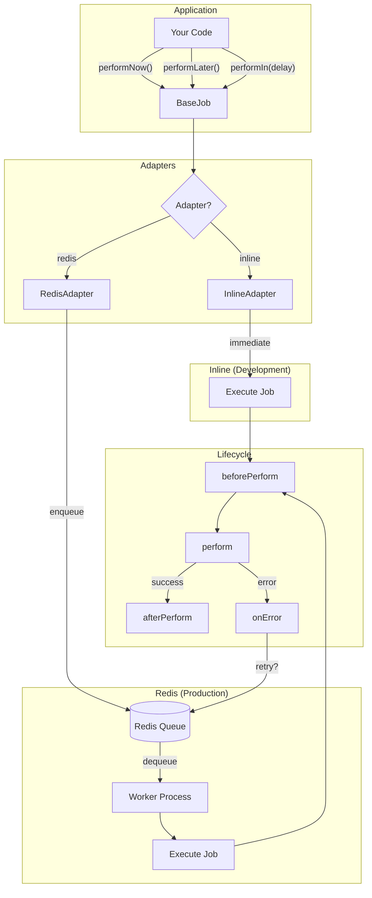

# rjobs

A Rails ActiveJob-inspired background job framework for Node.js. Supports multiple queue adapters including inline execution and Redis-backed queues via BullMQ.

## Features

- **Rails-like API**: `performNow()`, `performLater()`, `performIn()`, `performAt()`
- **Auto-loading**: Jobs in a `jobs/` folder are automatically available globally
- **Multiple adapters**: Inline (immediate) and Redis (BullMQ/Sidekiq-like)
- **Job lifecycle hooks**: `beforePerform`, `afterPerform`, `onError`
- **Configurable retries**: Per-job retry attempts with backoff
- **Named queues**: Route jobs to specific queues for prioritization
- **Delayed execution**: Schedule jobs for future execution

## Installation

```bash
pnpm install
```

## Quick Start

### 1. Create a jobs folder and define jobs

```javascript
// jobs/c.js
import { BaseJob } from 'rjobs';

export default class C extends BaseJob {
  async perform(name = 'world') {
    console.log(`hi ${name}`);
  }
}
```

```javascript
// jobs/send-email.js
import { BaseJob } from 'rjobs';

export default class SendEmail extends BaseJob {
  static queue = 'mailers';
  static retryAttempts = 5;

  async perform(to, subject, body) {
    console.log(`Sending email to ${to}: ${subject}`);
    return { sent: true };
  }
}
```

### 2. Load jobs and use them globally

```javascript
// index.js
import { loadJobs, config } from 'rjobs';

config.queueAdapter = 'inline';

// Load all jobs from ./jobs and register them globally
await loadJobs('./jobs');

// Jobs are now available globally - no imports needed!
await C.performNow('zeon');           // prints: hi zeon
await C.performLater('world');        // prints: hi world

await SendEmail.performNow('user@example.com', 'Hello', 'World');
```

### 3. Use Redis Adapter for Production

```javascript
import { loadJobs, config, startWorker } from 'rjobs';

// Configure Redis adapter
config.queueAdapter = 'redis';
config.redis = { host: 'localhost', port: 6379 };

// Load jobs (also registers them with the worker)
await loadJobs('./jobs');

// Enqueue jobs (they go to Redis)
await SendEmail.performLater('user@example.com', 'Hello', 'World');
```

### 4. Run Workers (separate process)

```javascript
// worker.js
import { loadJobs, config, startWorker, setupGracefulShutdown } from 'rjobs';

config.queueAdapter = 'redis';
config.redis = { host: 'localhost', port: 6379 };

// Load and register all jobs
await loadJobs('./jobs');

// Start workers for each queue
startWorker('default', { concurrency: 2 });
startWorker('mailers', { concurrency: 1 });

// Handle Ctrl+C gracefully
setupGracefulShutdown();
```

## Manual Job Definition (without auto-loading)

If you prefer explicit imports over global registration:

```javascript
import { BaseJob, config } from 'rjobs';

class MyJob extends BaseJob {
  async perform(data) {
    console.log('Processing:', data);
  }
}

config.queueAdapter = 'inline';

await MyJob.performNow({ foo: 'bar' });
await MyJob.performLater({ foo: 'bar' });
```

## Configuration

```javascript
import { config } from 'rjobs';

// Set queue adapter: 'inline' or 'redis'
config.queueAdapter = 'redis';

// Configure Redis connection
config.redis = {
  host: 'localhost',
  port: 6379,
  password: 'secret'  // optional
};

// Default retry settings (can be overridden per-job)
config.defaultRetryAttempts = 3;
config.defaultBackoffDelay = 1000;
```

## Runtime Options with `set()`

Override job options for a single enqueue:

```javascript
// Use a different queue for this specific call
await SendEmailJob
  .set({ queue: 'high_priority' })
  .performLater('vip@example.com', 'Urgent', 'Important message');

// Override retry settings
await SendEmailJob
  .set({ attempts: 10, backoff: 5000 })
  .performLater('user@example.com', 'Important', 'Please retry many times');
```

## Running the Examples

```bash
# Install dependencies
pnpm install

# Run the demo app (shows global job usage)
node examples/demo-app/index.js

# Run inline adapter demo
node examples/usage.js inline

# Run Redis adapter demo (requires Redis)
# Terminal 1: Start Redis
docker run -p 6379:6379 redis:alpine

# Terminal 2: Start workers
node examples/worker-runner.js

# Terminal 3: Enqueue jobs
node examples/usage.js redis
```

## API Reference

### BaseJob

| Method | Description |
|--------|-------------|
| `static performNow(...args)` | Executes job immediately |
| `static performLater(...args)` | Enqueues job for async execution |
| `static performIn(delayMs, ...args)` | Enqueues job with delay |
| `static performAt(date, ...args)` | Enqueues job for specific time |
| `static set(options)` | Returns chainable object with overridden options |

### Loader Functions

| Function | Description |
|----------|-------------|
| `loadJobs(dir, options)` | Loads jobs from directory and registers globally |
| `getJob(name)` | Gets a loaded job class by name |
| `getAllJobs()` | Returns Map of all loaded jobs |
| `clearJobs()` | Clears loaded jobs from memory and global scope |

### Lifecycle Hooks

| Hook | When Called |
|------|-------------|
| `beforePerform()` | Before `perform()` executes |
| `afterPerform(result)` | After successful `perform()` |
| `onError(error)` | When `perform()` throws an error |

### Worker Functions

| Function | Description |
|----------|-------------|
| `registerJob(JobClass)` | Registers a job class for the worker |
| `startWorker(queueName, options)` | Starts a worker for a queue |
| `startWorkers(queueNames, options)` | Starts workers for multiple queues |
| `stopWorkers()` | Gracefully stops all workers |
| `setupGracefulShutdown()` | Handles SIGTERM/SIGINT for clean shutdown |

## Adapters

### Inline Adapter

Executes jobs immediately in the current process. Useful for:
- Development and testing
- Simple applications without background processing needs
- Debugging job logic

### Redis Adapter

Uses BullMQ for distributed job processing. Features:
- Persistent job storage in Redis
- Horizontal scaling with multiple workers
- Automatic retries with configurable backoff
- Delayed and scheduled jobs
- Job completion and failure tracking

## Comparison with Rails ActiveJob

| Rails ActiveJob | active-job-node |
|-----------------|-----------------|
| `perform_now` | `performNow()` |
| `perform_later` | `performLater()` |
| `set(wait: 5.seconds)` | `performIn(5000, ...)` |
| `set(wait_until: time)` | `performAt(date, ...)` |
| `queue_as :mailers` | `static queue = 'mailers'` |
| `retry_on` | `static retryAttempts = N` |
| `before_perform` | `async beforePerform()` |
| `after_perform` | `async afterPerform(result)` |

## Architecture



## License

MIT
